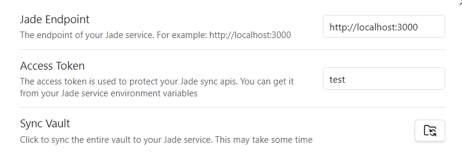

# Obsidian2Jade

This is a simple plugin to help publish your Obsidian vault to a public website(build
with [Jade](https://github.com/LucasJi/Jade)).

## Download and Install

Search "Obsidian2Jade" in the official "[community plugin list](https://obsidian.md/plugins)", then
install the plugin.

## Usage

### First-Time Usage

1. Download and install this plugin
2. Make sure your Jade service is running
3. In Obsidian2Jade setting page
	- Config the endpoint(`NEXT_PUBLIC_BASE_URL` in `.env`) of your Jade service
	- Config the access token(`ACCESS_TOKEN` in `.env`)
4. Click `Sync Vault` button() to synchronize the whole vault for the first time

### Subsequent Usage

Once you perform any changes to your vault, you can click `Sync your changes to Jade`
button() in the left sidebar of Obsidian to immediately synchronize your
changes to your Jade service.
